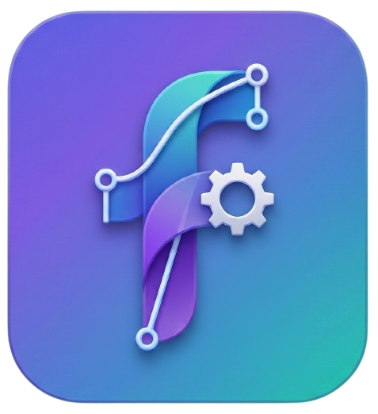
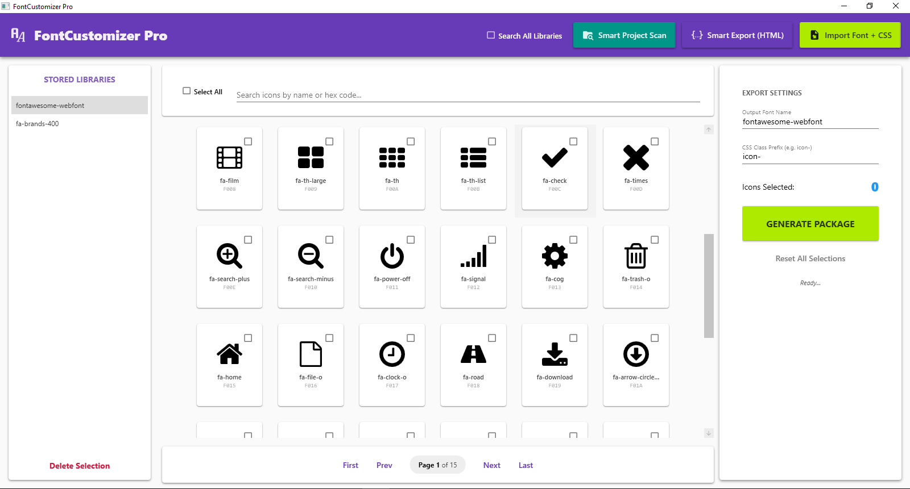

<div align="center">
  
  
  # 🎨 FontCustomizer Pro
  
  ### The Smartest Icon Font Optimization Tool for Faster Websites
  
  [](https://opensource.org/licenses/MIT)
  [](https://dotnet.microsoft.com/)
  [](https://www.microsoft.com/windows)
  [](https://github.com/mamadmamadu11-dotcom/FontCustomizer-Pro/releases)
  [](https://github.com/mamadmamadu11-dotcom/FontCustomizer-Pro/stargazers)
</div>

---

## 📸 Screenshots

<div align="center">
  
  
  *Main interface showing project scan results and icon detection*
</div>

---

## 📖 The FontCustomizer Pro Story
...
  

  
  
</div>

---

## 📖 The FontCustomizer Pro Story

### The Big Problem for Web Developers

Imagine building a professional website with **Font Awesome 6**:
- Main font file: **~200 KB**
- Total icons available: **~10,000**
- Icons you actually use: **Only 20!**

**The Result:** Users download 200 KB of fonts when they only need 20 icons!

### The Revolutionary Solution

This software works like a **smart security camera** scanning your entire project and detecting:
- Which icons are you using?
- How many times is each icon used?
- What fonts are in your project?

Then it extracts **only the icons you actually use** and creates a **lightweight, optimized font file**.

---

## 📊 Performance Comparison

### Before Using FontCustomizer Pro:
```
📦 Font Awesome 6: 200 KB
⏱️ Load Time: 300ms
📉 Pagespeed Score: 72
```

### After Using FontCustomizer Pro:
```
📦 Custom Font: 15 KB (92.5% reduction!)
⏱️ Load Time: 45ms (6.6x faster!)
📈 Pagespeed Score: 94
```

---

## 🚀 What Does It Do?

### 1. Smart Project Scanning
```
📁 Your Project
├── 📄 index.html
├── 📄 about.aspx
├── 📄 style.css
├── 📄 main.js
├── 📄 header.php
└── 📄 theme.cshtml

🔍 FontCustomizer Pro is scanning...
✅ 156 files analyzed
✅ 42 unique icons found
✅ 3 different fonts detected
```

### 2. Precise Icon Extraction
- Finds all `class="fa-*"` patterns
- Checks `data-icon` and `data-*` attributes
- Identifies used Unicode characters
- Detects icons inside `::before` and `::after` pseudo-elements

### 3. Custom Font Generation
- **WOFF2**: Ultra-compressed (best for web)
- **TTF**: For older systems
- **CSS**: With all required classes
- **Map File**: For easier debugging

---

## ✨ Key Features

| Feature | Description |
|---------|-------------|
| 🔍 **Auto Scan** | Scans entire project without manual setup |
| 🎯 **Precise Detection** | Finds even hidden icons in CSS |
| 📦 **Ultra Compression** | Reduces file size up to 95% |
| 🚀 **One-Click** | Complete operation with a single button |
| 📊 **Full Report** | Shows complete list of used icons |
| 🔄 **Multi-Font Support** | Font Awesome, Material Icons, Bootstrap Icons, and more |
| 💼 **Professional** | Suitable for large and team projects |

---

## 🎯 Who Needs This Tool?

### 1️⃣ Frontend Developers
> "I no longer worry about large font files! My websites load much faster now."

### 2️⃣ SEO & Optimization Specialists
> "With this tool, my clients' Pagespeed Insight scores went from 70 to 95!"

### 3️⃣ Web Designers
> "I don't have to choose between icon quality and site speed anymore. I have both!"

### 4️⃣ Project Managers
> "We reduced hosting and bandwidth costs by up to 30%."

### 5️⃣ WordPress Developers
> "I build lighter, faster themes that clients absolutely love."

---

## 📈 Impact on SEO & Core Web Vitals

### Before:
```
❌ Largest Contentful Paint (LCP): 2.8s
❌ First Input Delay (FID): 180ms
❌ Cumulative Layout Shift (CLS): 0.25
❌ Total Font Size: 200KB
```

### After:
```
✅ Largest Contentful Paint (LCP): 1.2s (57% improvement)
✅ First Input Delay (FID): 95ms (47% improvement)
✅ Cumulative Layout Shift (CLS): 0.05 (80% improvement)
✅ Total Font Size: 15KB (92.5% reduction)
```

> **Result:** Your website ranks higher in Google search results! 📈

---

## 🛠️ Technology Stack

```
🖥️ Framework: WPF (.NET 6.0)
📐 Architecture: MVVM (CommunityToolkit.Mvvm)
🎨 UI: Material Design
🔐 License: TON Blockchain
📦 Package: InnoSetup
```

---

## 📥 Installation & Setup

### Quick Method (Download Installer):
```bash
👉 Download from Releases section
👉 Run the Setup file
👉 Select your project folder
👉 Click "Start Scan"
👉 Wait for the new font to be generated
```

### Development Method (From Source Code):
```bash
git clone https://github.com/mamadmamadu11-dotcom/FontCustomizer-Pro.git
cd FontCustomizer-Pro
dotnet restore
dotnet build
dotnet run
```

---

## 🎬 Demo & Tutorial

[](https://youtu.be/XXXXXXXXXXX)

> Click to watch the full tutorial video (Coming soon)

---

## 🔗 Related Projects

Check out my other tools:

- 🛠️ **[Batch-Coding-Tools](https://github.com/mamadmamadu11-dotcom/Batch-Coding-Tools)** - Command-line tools for AI-assisted coding
- 🎨 **FontCustomizer Pro** - That's you! 😊

---

## 🤝 Contributing

We welcome your contributions!

1. **Fork** the repository
2. Create your **Feature Branch** (`git checkout -b feature/AmazingFeature`)
3. **Commit** your changes (`git commit -m 'Add some AmazingFeature'`)
4. **Push** to the branch (`git push origin feature/AmazingFeature`)
5. Open a **Pull Request**

### Ideas for Contributions:
- Add support for new font libraries
- Improve the scanning algorithm
- Build Mac and Linux versions
- Add new themes to the UI

---

## 📄 License

This project is licensed under the **MIT License**.

---

## ⭐ Support

If this project helped you:
- Give it a **Star** ⭐
- **Share** it with others
- **Report** issues you find
- **Suggest** improvements

---

## 📞 Contact

- **Questions & Issues**: [Create an Issue](https://github.com/mamadmamadu11-dotcom/FontCustomizer-Pro/issues)
- **Email**: mamadmamadu11@gmail.com
- **Telegram**: [@mMohammad_mrgh](https://t.me/Mohammad_mrgh)


<div align="center">
  <b>Made with ❤️ for the Web Development Community</b>
</div>
```
